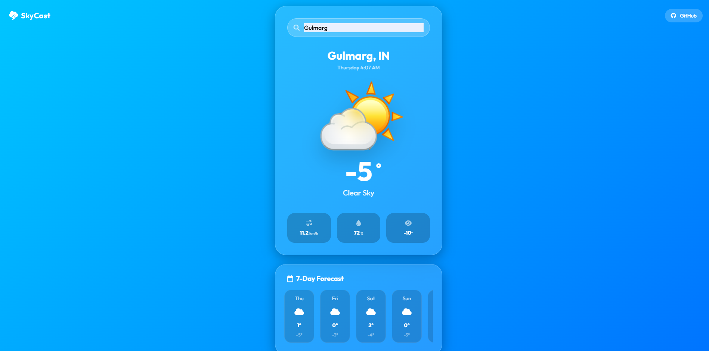
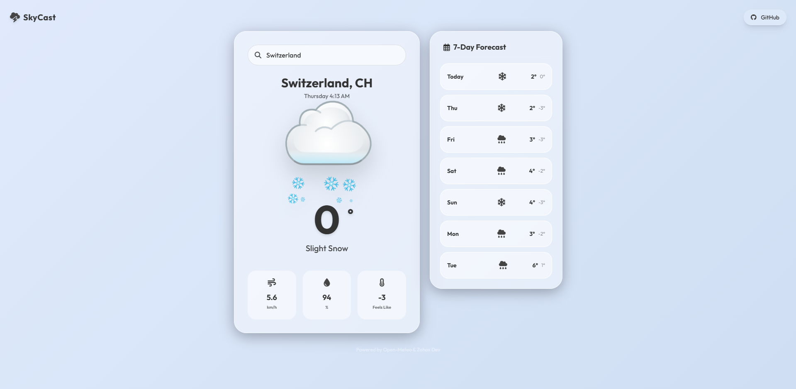
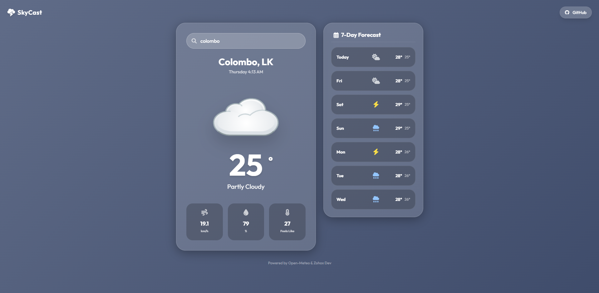
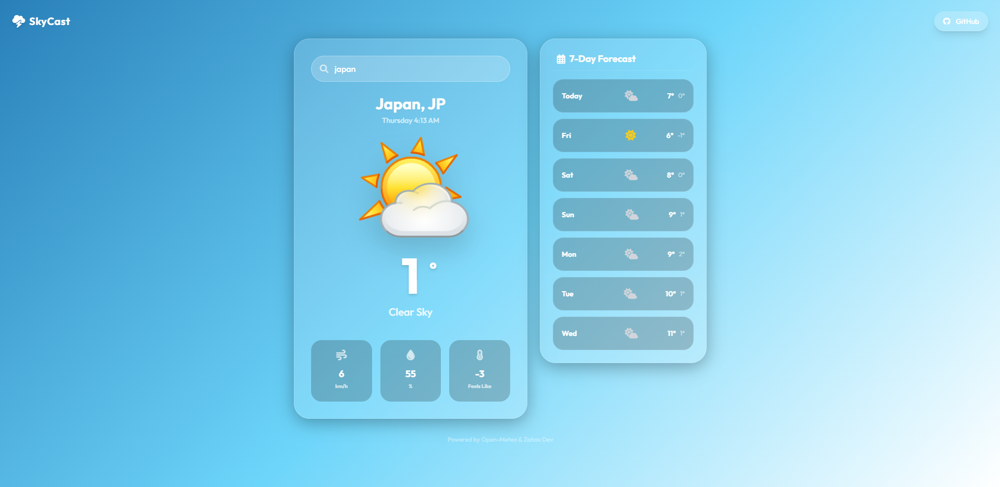

# 🌤️ SkyCast — Modern Weather Web App

A **next-level Weather Web Application** with a stunning **glassmorphism UI**, smooth animations, and a clean user experience.  
SkyCast delivers real-time weather data and a 7-day forecast in a beautifully designed interface.

> Built with modern web technologies & crafted for premium UI/UX lovers.

---

## 🚀 Live Demo

🔗 **View Live App:**  
👉 [LIVE Demo](https://sadewdev.github.io/SkyCast/)

---

## 📸 Screenshots

> A glimpse of SkyCast’s elegant design and smooth layout.

### Screenshot 01

### Screenshot 02

### Screenshot 03

### Screenshot 04

---

## ✨ Features

- 🌎 **Search weather by country or city**
- 📆 **7-Day weather forecast**
- 🌡️ **Real-time temperature & conditions**
- 💨 Wind speed, 💧 humidity & “feels like” temperature
- 🎨 **Glassmorphism UI design**
- 🧊 Soft gradients & smooth shadows
- ⚡ Fast & lightweight
- 📱 Fully responsive (Mobile / Tablet / Desktop)

---

## 🛠️ Built With

- **HTML5**
- **CSS3**
- **JavaScript (ES6+)**
- **Open-Meteo API**
- **Modern UI/UX principles**
- **Glassmorphism Design**

---

## 📂 Project Structure

